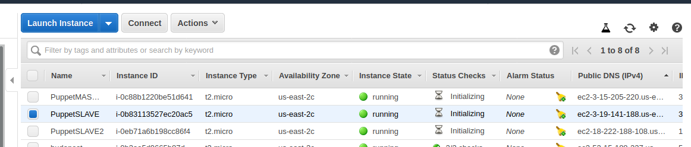

# ** ONE STOP GUIDE TO INSTALL AND CONFIGURE PUPPET **

## Make sure you follow the sequence listed below:

1. Login to your AWS console and Search for EC2

<kbd></kbd>

2. Click on Instances -> Launch Instance -> Ubuntu Server -> Select number of machines (master + slave included)

<kbd></kbd>

<kbd></kbd>

<kbd></kbd>

<kbd></kbd>

3. On 6th Step of spinning ubuntu instances,add two security groups "All Traffic & All TCP" and set their constraint to "ANYWHERE".

<kbd></kbd>

<kbd></kbd>

4. Finish, Launch and Procced.

### First open slave machines and run the following:
```
git clone https://github.com/KR-Ravindra/PuppetScripts.git
cd PuppetScripts
chmod +x slave.sh
sudo ./slave.sh

```

<kbd></kbd>

Add master machine IP adress when prompted.

### Now open the master machine and run the following:

```
git clone https://github.com/KR-Ravindra/PuppetScripts.git
cd PuppetScripts
chmod +x master.sh
sudo ./master.sh

```

<kbd></kbd>

<kbd></kbd>

Add Slave machines when prompted

### On slave machine run 

```
sudo puppet agent --test
```
<kbd></kbd>

Copy the slave machine IP address and check the nginx server deployed. (If default manifesto is used).

<kbd></kbd>

## You will be successfully working with puppet. Reward me a star :shipit:
